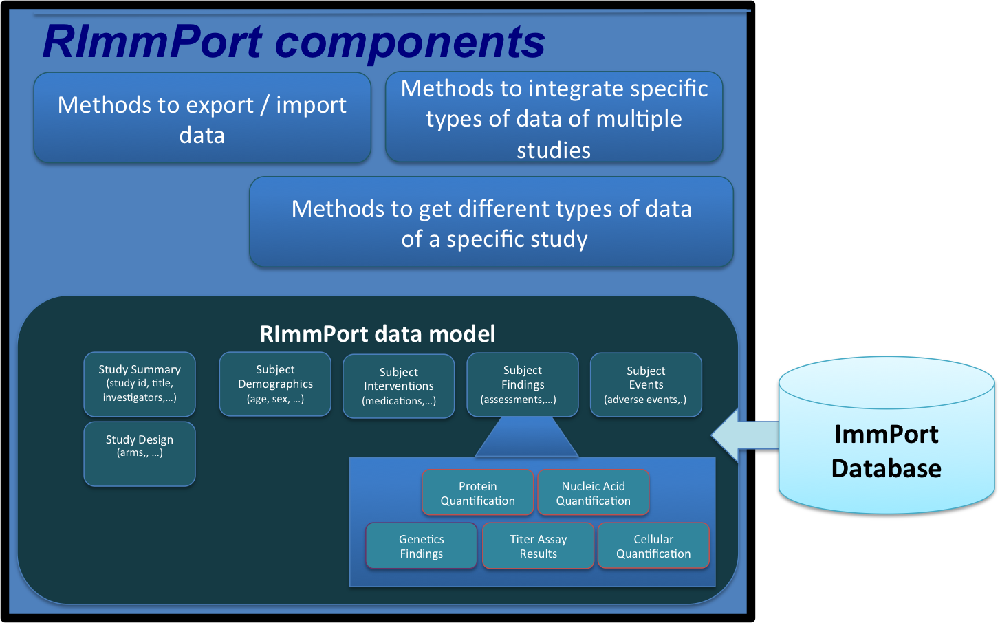
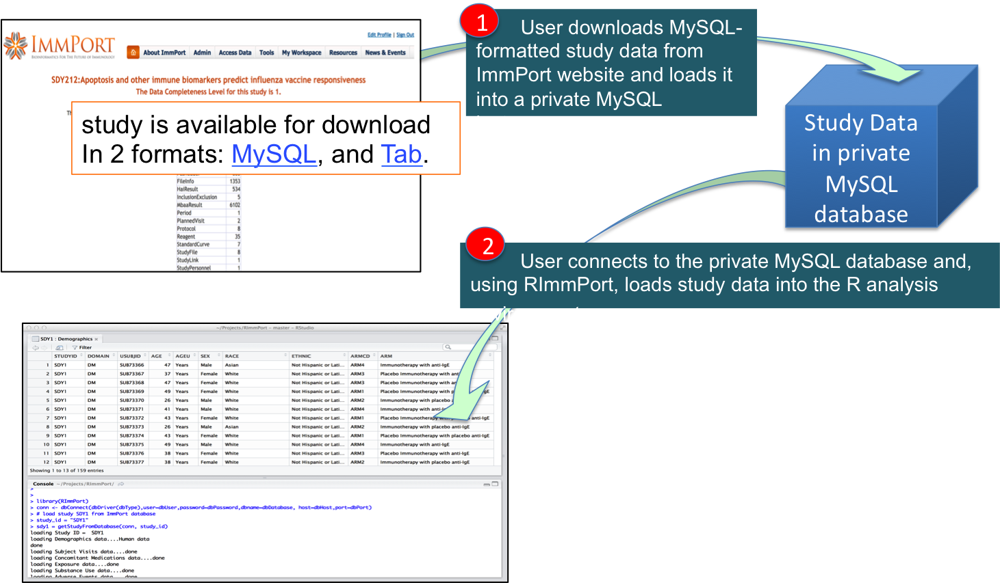

*****
# Introduction

Publicly available raw individual-level clinical trial data has created tremendous opportunity to evaluate new research hypotheses that were not originally formulated in the studies; by reanalyzing data from a study, by performing cross analysis of multiple studies, or by combining study data with other public research datasets. But such analysis of disparate data presupposes a) uniform representation of clinical trial data using data standards, and b) easy access to such standard representations of clinical trial data in analytical environments. 
`ImmPort`, the Immunology Database and Analysis Portal (immport.niaid.nih.gov) system, warehouses clinical study data in all areas of immunology that is generated by scientific researchers supported by the National Institute of Allergy and Infectious Diseases (`NIAID`). Currently, more than 100 studies are publicly available in ImmPort. The `RImmPort` package simplifies access to ImmPort data for analysis, as the name implies, in the R statistical environment. It provides a standards-based interface to the ImmPort study data that is in a proprietary format. 

# Overview of ImmPort

`ImmPort`, the Immunology Database and Analysis Portal (immport.niaid.nih.gov) system, warehouses clinical trials data in all areas of immunology that is generated primarily by investigators funded by the US National Institute of
Allergy and Infectious Diseases (NIAID). With more than 100 datasets now publicly available and hundreds of downloads per month, ImmPort is an important source for raw data and protocols from clinical trials, mechanistic studies, and novel methods for cellular and molecular measurements. The different types of study-related data that are found in ImmPort include: 

- Study Summary
- Arms
- Subject Demographics
- Assessments
- Concomitant Medications
- Study Interventions
- Laboratory Test Results 
- Mechanistic Assay Results 
- Adverse Events

The [Open ImmPort](http://www.immport.org/) provides interface to explore metadata of all studies that are publicly available, in order to locate the studies of interest. The [ImmPort](https://immport.niaid.nih.gov/) website houses all the study data. Users can download any of the data after registering at the ImmPort website (registration is free). The study data is available in 2 formats: MySQL format and Tab Separated Value (TSV) format. The RImmPort package works with both the formats. The [schema](http://immport.org/immport-open/public/schema/schemaDefinition/study) and the [entity-relationship diagrams](http://immport.org/immport-open/public/schema/schemaDiagram/AllTables) document ImmPort's proprietary database model that is employed in the MySQL format of study data and is also reflected in the Tab format. Study data may be downloaded for each individual study, or the entire set of data for all studies may be downloaded as one file. In the case of MySQL format, users need to run a private instance of MySQL database, load the downloaded study data into that database instance, and then query the data for analysis. In the case of Tab format, users will read the tab-delimited files into their analytical environment and then perform data analysis.

# Overview of RImmPort 

`RImmPort` package simplifies access to ImmPort data for analysis, as the name implies, in the R statistical environment. Essentially,it provides a standards-based interface to the proprietary MySQL-formatted or Tab-formatted ImmPort data. It comprises of four main components: 1) an RImmPort data model that encapsulates ImmPort study data. The model leverages of study data standards from the Clinical Data Interchange Standards Consortium (CDISC), and incorporates terms and semantics found in these standards, 2) foundational methods to query and load different types of data of a specific study in ImmPort, 3) methods to search and integrate specific types of study data of multiple studies, and 4) utility methods to export and import study data in RImmPort format. 


The RImmPort workflow is illustrated in the following figure. User creates a private MySQL database instance, downloads study data of interest from ImmPort website, and loads the data into the private database. In R, user connects to the private ImmPort database, and calls the methods in the RImmPort library, to load a specific study from the database into R.



Using RImmPort, an entire study can be loaded into R with a single command. For example, a researcher interested in analyzing a specific study ImmPort Identifier:SDY1, can use RImmPort to easily access different types of individual-level data -subject demographics, clinical assessments, adverse events, results of flow cytometry and ELISA experiments on 4211 biosamples collected at different time points over 12 weeks from 159 subjects. 

\pagebreak

# Overview of CDISC SDTM Data Standard

The Clinical Data Interchange Standards Consortium ([CDISC](http://www.cdisc.org/)) has been developing a suite of data standards, supporting different stages of the clinical research process: study design, study conduct, data analysis and reporting. The Study Data Tabulation Model ([SDTM](http://www.cdisc.org/sdtm/)) defines a data tabulation standard that can be used to structure study data when submitting to regulatory agencies such as the United States Food and Drug Administration (FDA). In SDTM, the data is structured in a hierarchy, as Classes, Domains, Variables and Values. Here is a list of foundational classes and a partial set of domains under each class:

- Special Purpose Class
    - Demographics (DM) Domain
    - Subject Visits (SV) Domain
- Interventions Class
    - Concomitant Medications (CM) Domain
    - Exposure (EX) Domain
    - Substance Use (SU) Domain
- Events Class
    - Adverse Events (AE) Domain
    - Medical History (MH) Domain
- Findings Class
    - Laboratory Test Results (LB) Domain
    - Vital Signs (VS) Domain
    - Physical Examination (PE) Domain
- Trial Design Class
    - Trial Summary (TS) Domain
    - Trial Arms (TA) Domain

Each Domain defines a standard set of Variables that are appropriate for that Domain, and should be used to structure data of that domain. As an example, the table shows a partial list of Variables for the Demographics (DE) Domain:

| Variable Name | Variable Label |
|:-------|:-----|
| STUDYID | Study Identifier  |
| DOMAIN  | Domain Abbreviation |
| USUBJID | Unique Subject Identifier |
| AGE | Age |
| AGEU | Age Units |
| SEX | Sex |
| RACE | Race |
| ARMCD | Planned Arm Code |

Continuing with this example, Demographics data of a specific study can be tabulated using the SDTM Demographics Domain:

| row | STUDYID | DOMAIN | USUBJID | AGE | AGEU | SEX | RACE | ARMCD |
|:------:|:-----:|:-----:|:-----:|:-----:|:-----:|:-----:|:-----:|
| 1 | SDY1  | DM | SUB73366 | 47 | Years | Male | White | ARM4 |
| 2 | SDY1  | DM | SUB73367 | 37 | Years | Female |Asian | ARM3 |
| 3 | SDY1  | DM | SUB73368 | 47 | Years | Female |Multiple | ARM3 |

If the study data has variables that are not in the standard set, SDTM provides a Name-Value pair mechanism to create Supplemental Domain data. In the example, the standard variable RACE captures subject's race. If the study has collected data on all applicable races of a subject, then the Supplemental Demographics Domain data, can be tabulated as follows, with RACE1 and RACE2 as non-standard Variables:

| row | STUDYID | RDOMAIN | USUBJID | QNAM | QLABEL | QVALUE | 
|:------:|:-----:|:-----:|:-----:|:-----:|:-----:|:-----:|:-----:|
| 1 | SDY1  | DM | SUB73368 | RACE1 | Race 1 | Black or African American | 
| 2 | SDY1  | DM | SUB73368 | RACE2 | Race 2 | American Indian or Alaska Native |

Thus, all of the study data can be structured as SDTM Domain data tables, and any supplemental Domain data tables. For new types of research data that does not naturally map to an existing SDTM domain, SDTM allows creating custom Domains. The custom Domain can then be proposed to the SDTM standards committee, to be developed into a standard.


\pagebreak


# RImmPort Data Model

The RImmPort data model implements the SDTM data standards in encapsulating the different types of the ImmPort study data. The model comprises of the following Classes and Domains (codes in parentheses):

- Special Purpose 
    - Demographics (DM) - describes each subject in a clinical study
    - Subject Visits (SV) - collates the timing information on subject visits 
- Interventions 
    - Concomitant Medications (CM) - concomitant and prior medications/therapies used by the subject
    - Exposure (EX) - subject's exposure to protocol specified study treatment
    - Substance Use (SU) - substance use information
- Events 
    - Adverse Events (AE) - adverse event information
    - Protocol Deviations (DV) - protocol violations and deviations during the course of the study
    - Medical History (MH) - subject's prior medical history at the start of the trial
    - Associated Persons Medical History (APMH) - medical history of persons associated with the subject
- Findings 
    - Laboratory Test Results (LB) - laboratory test findings including, but not limited to hematology, clinical chemistry and urinalysis data.
    - Vital Signs (VS) - measurements including but not limited to blood pressure, temperature, respiration, body surface area, BMI, height and weight.
    - Questionnaires (QS) - information on questionnaires
    - Physical Examination (PE) - findings collected during a physical examination of the subject
    - Findings About (FA) - a dataset used to capture the findings about an event or intervention that cannot be represented within an event or intervention record or as a supplemental.
    - Skin Response (SR) - skin assessment results
    - Genetics Findings (PF) - genetics findings (Array and HLA Typing assays)
    - Protein Quantification (ZA) -  non-standard domain for protein quantification data (ELISA and MBAA assays)
    - Cellular Quantification (ZB) - non-standard domain for cellular quantification data (Flow and ELISPOT assays)
    - Nucleic Acid Quantification (ZC) - non-standard domain for nucleic acid quantification data (PCR assays)
    - Titer Assay Results (ZD) -  non-standard  domain for titer assay results data (HAI and Neut Ab Titer assays)
- Trial Design 
    - Trial Arms (TA) - all the planned arms in the trial
    - Trial Inclusion Exclusion Criteria (TI) - all the inclusion and exclusion criteria for the trial
    - Trial Summary (TS) - information about the planned and actual trial characteristics

## RImmPort `Study` reference class

The `Study` reference class and its components (shown below) form the core of the RImmPort data model, and is designed to parallel SDTM's Class, Domain, Variable and Value model.  


```{r eval=FALSE}

# Truncated code to improve clarity - for illustration purpose only

Study <- setRefClass("Study", fields = list(
  special_purpose="SpecialPurpose",
  interventions="Interventions",
  events="Events",
  findings="Findings",
  trial_design="TrialDesign"),
  ...
))

SpecialPurpose <- setRefClass("SpecialPurpose", 
                             fields = list(
                               dm_l="list",
                               sv_l="list"),  
                             ...

Interventions <- setRefClass("Interventions", 
                                fields = list(
                                  cm_l="list",
                                  ex_l="list",
                                  su_l="list"),  
                             ...

Events <- setRefClass("Events", fields = list(
                                  ae_l="list",
                                  dv_l="list",
                                  mh_l="list",
                                  apmh_l="list"),  
                      ...

Findings <- setRefClass("Findings", 
                        fields = list(
                                lb_l="list",
                                pe_l="list",
                                vs_l="list",
                                qs_l="list",
                                fa_l="list",
                                sr_l="list",
                                pf_l="list",
                                za_l="list",
                                zb_l="list",
                                zc_l="list",
                                zd_l="list"),
                        ...

TrialDesign <- setRefClass("TrialDesign", 
                        fields = list(
                          ta_l="list",
                          ti_l="list",
                          ts_l="list"),
                        ...
                        

```

### Notes on `Study` reference class and its components
- There is a reference class for each of the five SDTM Classes (SpecialPurpose, Interventions, Events, Findings, and TrialDesign). 
- The Domains are listed as fields of respective reference classes. For example, the field `dm_l` in the `SpecialPurpose` reference class is associated with the Demographics domain. The convention in naming the Domain field is `<lower-case Domain code>_l`, for e.g., `dm_l` for Demographics domain. 
- All the Domain fields (`dm_l`, `sv_l`, `lb_l`, etc.) are of type `list`. When the `'Study` reference class is instantiated with data of a specific study, each domain field will contain a list of 2 named dataframes, Domain data and any supplemental Domain data. For.e.g., `dm_l` is a list of `dm_f` (Demographics data), and `suppdm_f` (supplemental Demographics data). 
- In a specific study, if there is specific Domain data, but no corresponding supplemental Domain data, then there will be an empty supplemental dataframe. For e.g., if there is no supplemental Demographics data, then `suppdm_df` will be an empty dataframe.
- In a specifc study, if there is no data for a specific domain, then the Domain field list will be empty. For e.g., if there no Substance Use data, then the `su_l` will be an empty list.
- RImmPort function `getStudy()` instantiates the `Study` reference class with data of a specific study in the ImmPort data source The hierarchical structure of the `Study` instance can then be traversed to access different types of study data (see Section `Get all data of a specific study`).


\pagebreak


# RImmPort Functions

RImmPort supports a set of functions to load different types of study data. The functions generally comprise of 3 steps: 1) query study data from the ImmPort data source, 2) map the data to CDISC SDTM-based RImmPort model, and 3) load the data into the R environment. The documentation on all these functions can be found in the RImmPort reference manual (`RImmPort-manual.pdf`). The documentation can also be accessed from the R console using the `help (?)` function, for e.g., `?getStudy`.

## Foundational Functions
The foundational functions enable loading different types of study data of a specific ImmPort study. An intitial step, before invoking any of the "get data" functions, is setting the ImmPort data source that these functions operate upon. As mentioned earlier, ImmPort data comes in 2 formats, MySQL and Tab, and RImmPort can work with either one. User can set up a MySQL data source by creating a MySQL database and loading the database with ImmPort study data that is in MySQL format. For the Tab data source, RImmPort provides a utility function to create a private SQLite database and load the database with ImmPort study data that is in Tab format. The `setImmPortDataSource` function takes in as input a connection handle to either the MySQL database or the SQLite database, and sets that database as the ImmPort data source that other RImmPort functions use.

### Load the RImmPort library
```{r}
library(RImmPort)
library(DBI)
library(sqldf)
library(plyr)
```

### Set the MySQL database as ImmPort data source

```{r eval=FALSE}

# provide appropriate MySQL database connection parameters
mysql_conn <- dbConnect(MySQL(), user="username", password="password", 
                   dbname="database",host="host")

# set the data source as the ImmPort MySQL database.

```{r  eval=FALSE}
setImmPortDataSource(mysql_conn)
```

### Set the SQLite database as ImmPort data source

```{r}
# get the directory of a sample SQLite database that has been bundled into the RImmPort package
db_dir <- system.file("extdata", "ImmPortStudies", "Db", package = "RImmPort")

# connect to the database
sqlite_conn <- dbConnect(SQLite(), dbname=file.path(db_dir, "ImmPort.sqlite"))

# set the ImmPort SQLite database as the ImmPort data source
setImmPortDataSource(sqlite_conn)
```

### NOTE: In rest of this document, all RImmPort functions will use the SQLite ImmPort database as the ImmPort data source.

### Get all data of a specific study
The `getStudy` queries the ImmPort database for the entire dataset of a specifc study, and instantiates the `Study` reference class with that data. 

```{r}
# view documentation on Study
?Study

# get all study ids
getListOfStudies()

# load the entire data of study: `SDY139`
study_id <- 'SDY139'
sdy139 <- getStudy(study_id)

# access Demographics data of SDY139
dm_df <- sdy139$special_purpose$dm_l$dm_df
head(dm_df)

# access Concomitant Medications data of SDY139
cm_df <- sdy139$interventions$cm_l$cm_df
head(cm_df)

# get Trial Title from Trial Summary
ts_df <- sdy139$trial_design$ts_l$ts_df
title <- ts_df$TSVAL[ts_df$TSPARMCD== "TITLE"]
title
```

### Get specific domain data of a specific study
The `getDomainDataOfStudies` function takes as inputs, the name of the Domain of interest, and one or more study identifiers.  The function returns a list of 2 named dataframes, Domain data and any supplemental Domain data; for e.g.,`dm_f` (Demographics data), and `suppdm_f` (supplemental Demographics data). The Domain name should be exact to what is found in the list of Domain names. 

```{r}

# get the list of names of all supported Domains
getListOfDomains()

?"Demographics Domain"

# get domain code of Demographics domain
domain_name <- "Demographics"
getDomainCode(domain_name)

dm_l <- getDomainDataOfStudies(domain_name, "SDY139")
if (length(dm_l) > 0) 
  names(dm_l)
head(dm_l$dm_df)

```

## Search and Integrate Functions
RImmPort supports methods to search and integrate specific types of study data of multiple studies.

### Get studies with specifc domain data
The `getStudiesWithSpecificDomainData` takes as input the name of Domain of interest, and outputs a list of studies that have the specific Domain data.

```{r}
# get list of studies with Cellular Quantification data
domain_name <- "Cellular Quantification"
study_ids_l <- getStudiesWithSpecificDomainData(domain_name)
study_ids_l
```

### Get specifc domain data of a set of studies
The `getDomainDataOfStudies` function takes as inputs, the name of the Domain of interest, and a list of study identifiers, and outputs a Domain dataframe and any supplemental Domain dataframe that contain integrated Domain data. 

```{r}
# get Cellular Quantification data of studies `SDY139` and `SDY208`

# get domain code of Cellular Quantification domain
domain_name <- "Cellular Quantification"
getDomainCode(domain_name)

study_ids <- c("SDY139", "SDY208")
domain_name <- "Cellular Quantification"
zb_l <- getDomainDataOfStudies(domain_name, study_ids)
if (length(zb_l) > 0) 
  names(zb_l)
head(zb_l$zb_df)
```

### Get the list of assay types  
The function `getListOfAssayTypes` returns a list of assay types that ImmPort has data for.

```{r}
getListOfAssayTypes()
```

### Get specific assay data of one or more studies

The results of assays that were performed in the study are organized into 5 specialized Findings domains: Genetics Findings (PF), Protein Quantification (ZA), Cellular Quantification (ZB), Nucleic Acid Quantification (ZC) and Titer Assay Results (ZD). There can be a many-to-many relationship between the 5 domains and the assay types. The RImmPort function `getAssayDataOfStudies()` takes as input an assay type and and a list of study identifiers, and outputs a list of dataframes of the 5 Findings domains that have the assay data.

```{r}

# get 'ELISPOT' data of study `SDY139`
assay_type <- "ELISPOT"
study_id = "SDY139"
elispot_l <- getAssayDataOfStudies(study_id, assay_type)
if (length(elispot_l) > 0)
  names(elispot_l)
head(elispot_l$zb_df)

```

## Utility functions
RImmPort has a set of utility methods to export and import study data in RImmPort format, and to build the SQLite database from Tab formatted ImmPort downloads.

### Serialize study data in RImmPort format
The function `serialzeStudyData()` serializes the entire RImmPort-formatted study data as .rds files
```{r eval=FALSE}
# get the directory where ImmPort sample data is stored in the directory structure of RImmPort package
studies_dir <- system.file("extdata", "ImmPortStudies", package = "RImmPort")

# serialize all of the data of studies `SDY139` and `SDY208'
study_ids <- c('SDY139', 'SDY208')

# the folder where the .rds files will be stored
rds_dir <- file.path(studies_dir, "Rds")

serialzeStudyData(study_ids, rds_dir)
list.files(rds_dir)

```

### Load serialized study data into the R environment
The function `loadSerializedStudyData()` loads the serialzed data (.rds) files of a specific domain of a study from the directory where the files are located
```{r}
# get the directory where ImmPort sample data is stored in the directory structure of RImmPort package
studies_dir <- system.file("extdata", "ImmPortStudies", package = "RImmPort")

# the folder where the .rds files will be stored
rds_dir <- file.path(studies_dir, "Rds")

# list the studies that have been serialized
list.files(rds_dir)

# load the serialized data of study `SDY208` 
study_id <- 'SDY208'
dm_l <- loadSerializedStudyData(rds_dir, study_id, "Demographics")
head(dm_l[[1]])

```

### Build a private SQLite ImmPort database instance. 
The funciton `buildNewSqliteDb` reads the Tab-formatted study data zip files that the user has downloaded from the ImmPort website, and creates a SQLite database.
```{r}
# get the directory where ImmPort sample data is stored in the directory structure of RImmPort package
studies_dir <- system.file("extdata", "ImmPortStudies", package = "RImmPort")

# set tab_dir to the folder where the zip files are located
tab_dir <- file.path(studies_dir, "Tab")
list.files(tab_dir)

# set db_dir to the folder where the database file 'ImmPort.sqlite' should be stored
db_dir <- file.path(studies_dir, "Db")
```
```{r eval=FALSE}
# build a new ImmPort SQLite database with the data in the downloaded zip files
buildNewSqliteDb(tab_dir, db_dir) 
```
```{r}
list.files(db_dir)
```

# Conclusion

By basing RImmPort on open formalism and by making it available in open source platforms, we ensure that clinical study data in ImmPort is ready for analysis, thus enabling innovative bioinformatics research in immunology.